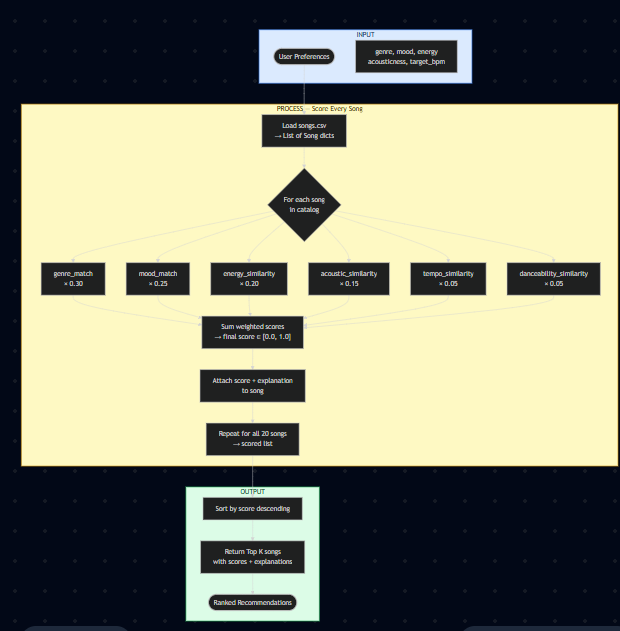
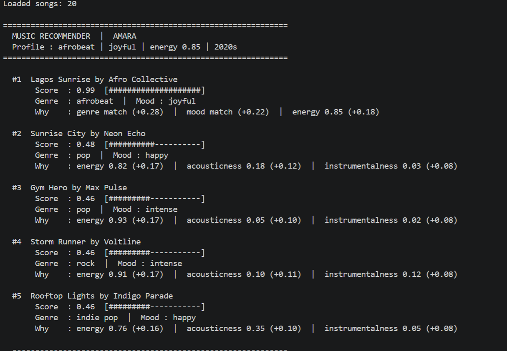
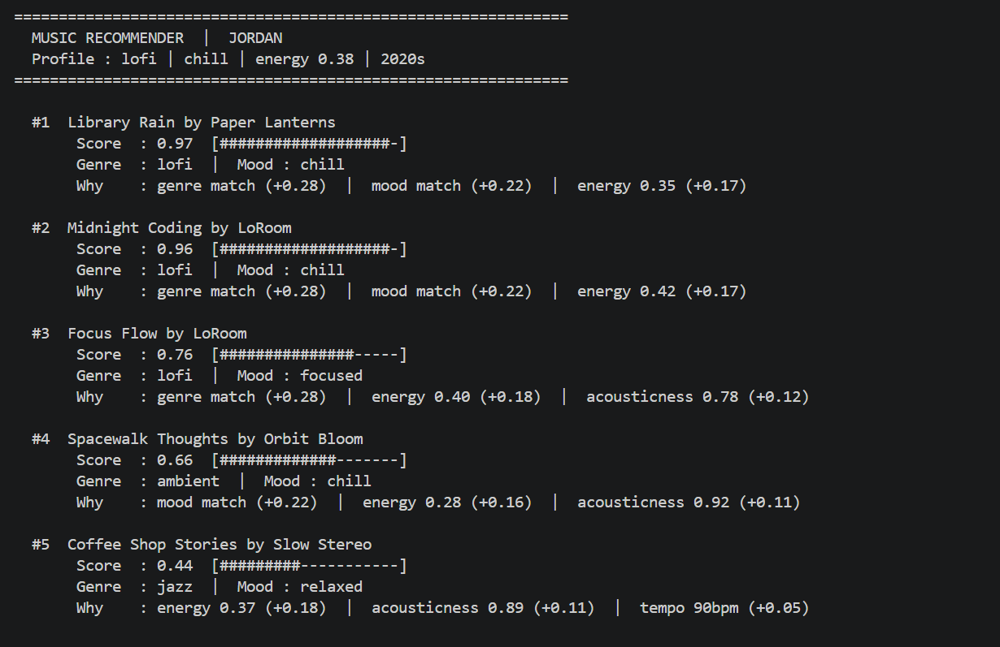
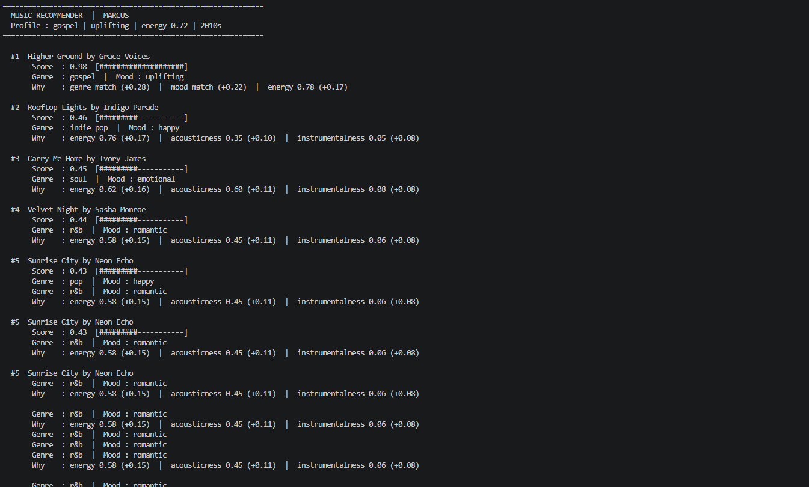
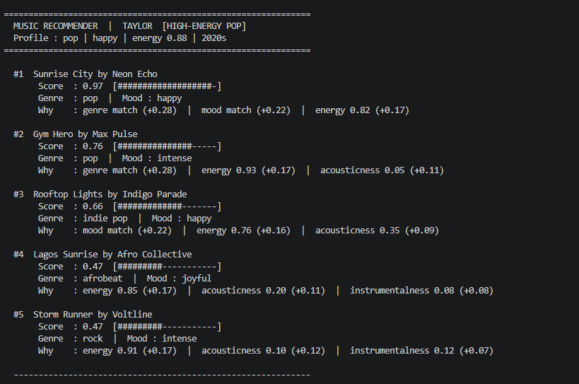
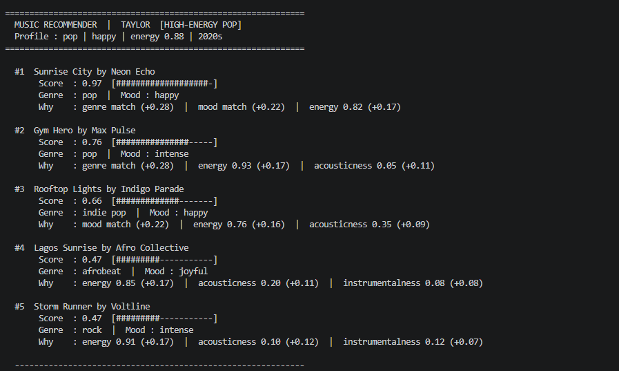

# 🎵 Music Recommender Simulation

## Project Summary

In this project you will build and explain a small music recommender system.

Your goal is to:

- Represent songs and a user "taste profile" as data
- Design a scoring rule that turns that data into recommendations
- Evaluate what your system gets right and wrong
- Reflect on how this mirrors real world AI recommenders

Replace this paragraph with your own summary of what your version does.

---

## How The System Works

Real-world recommenders like Spotify and YouTube work by combining two things: a **scoring rule** that measures how well each song fits a user's taste, and a **ranking rule** that curates the final ordered list. The scoring rule evaluates each song independently against the user's profile using audio features (energy, acousticness, tempo), categorical signals (genre, mood), and behavioral signals (likes, skips, replays). The ranking rule then goes beyond a simple sort — it filters, reorders, and diversifies the results so the user does not just receive five near-identical songs. This simulation prioritizes **content-based filtering**: matching songs to a user purely from their attributes and a stated taste profile, without needing play history or other users' behavior. The emphasis is on transparency — every recommendation can be explained by pointing directly to the features that drove the score.



### Algorithm Recipe

**Data Flow:** User Preferences → Score Every Song → Ranked Output

1. **Load** `data/songs.csv` into a list of song dictionaries.
2. **For each song**, compute a weighted score against the user's preference profile:

| Feature | Weight | How It Is Scored |
|---|---|---|
| `genre` | **0.30** | `1.0` if song genre matches user's preferred genre, `0.0` otherwise |
| `mood` | **0.25** | `1.0` if song mood matches user's preferred mood, `0.0` otherwise |
| `energy` | **0.20** | `1 - abs(song.energy - user.energy)` — penalizes distance from target |
| `acousticness` | **0.15** | `song.acousticness` if user likes acoustic; `1 - song.acousticness` if not |
| `tempo_bpm` | **0.05** | `1 - abs(song.tempo_bpm - user.target_bpm) / 100`, clamped to [0, 1] |
| `danceability` | **0.05** | `1 - abs(song.danceability - user.energy)` — energy used as a proxy |

3. **Sum** all weighted components into a final score between `0.0` and `1.0`:

```
score = (0.30 × genre_match)
      + (0.25 × mood_match)
      + (0.20 × energy_similarity)
      + (0.15 × acoustic_similarity)
      + (0.05 × tempo_similarity)
      + (0.05 × danceability_similarity)
```

4. **Rank** all songs by descending score and return the top `k` (default: 5). Ties are broken by `popularity`.

**Why these weights?** Genre and mood together account for 55% of the score because users think in categorical terms first — "I want chill lofi right now." Energy (0.20) is the strongest continuous signal because loudness and pace are felt immediately. Acousticness (0.15) captures texture preference (live guitar vs. synth). Tempo and danceability (0.05 each) add a small tie-breaking boost but are partially redundant with energy in this catalog. Valence and popularity are excluded: valence has too narrow a range across the 20 songs to meaningfully separate them, and popularity reflects external behavior rather than personal taste fit.

### Potential Biases

- **Genre over-dominance.** At 0.30 weight, a genre mismatch is a near-disqualifier. A gospel song with a perfect energy and mood match for a user who prefers R&B will still score low — even if it would sound like a great fit to a human listener.
- **Mood is binary.** A "joyful" song scores 0 against a "happy" preference even though the two moods are closely related. The system has no understanding of mood proximity.
- **Catalog skew.** 8 of the 20 songs are from 2020. Users who prefer earlier decades will consistently receive lower scores across the board, not because the songs are a bad fit musically, but because the catalog itself is skewed toward recent releases.
- **Energy-as-proxy.** Using `user.energy` as a stand-in for danceability preference assumes active users want danceable songs and calm users do not — a reasonable heuristic, but not always true.

---

## Getting Started

### Setup

1. Create a virtual environment (optional but recommended):

   ```bash
   python -m venv .venv
   source .venv/bin/activate      # Mac or Linux
   .venv\Scripts\activate         # Windows

2. Install dependencies

```bash
pip install -r requirements.txt
```

3. Run the app:

```bash
python -m src.main
```

### Running Tests

Run the starter tests with:

```bash
pytest
```

You can add more tests in `tests/test_recommender.py`.

---

## Experiments You Tried

### Standard Profiles

#### Profile 1 — Amara (afrobeat / joyful / high energy)



`Lagos Sunrise` scores 0.99 — the only song matching genre, mood, energy, and acousticness simultaneously. Songs 2–5 all score ~0.48, showing how much the genre+mood match (0.50 combined weight) dominates. Without a genre match, the remaining slots are filled purely by audio proximity.

#### Profile 2 — Jordan (lofi / chill / low energy)



`Library Rain` and `Midnight Coding` both score above 0.96 — both are lofi/chill with matching instrumental and acoustic profiles. `Focus Flow` drops to 0.76 because its mood is `focused` not `chill`, costing the full 0.22 mood weight.

#### Profile 3 — Marcus (gospel / uplifting / mid energy)



`Higher Ground` scores 0.98 as the sole gospel/uplifting song. The remaining 4 slots drop sharply to ~0.43–0.46, filled by energy proximity alone — confirming that when a genre has only one representative, the recommender cannot build a coherent cluster beneath it.

#### Profile 4 — Taylor (pop / happy / high energy)



`Sunrise City` scores 0.97 — exact genre+mood match with near-identical energy. `Gym Hero` rises to #2 on genre match alone despite a mood mismatch (intense ≠ happy). `Rooftop Lights` (indie pop / happy) earns #3 via mood match. Shows that a genre match without mood still outscores a mood match without genre.

#### Profile 5 — Rex (rock / intense / high energy)



`Storm Runner` scores 0.98 — only rock/intense song in the catalogue. `Gym Hero` (pop/intense) earns #2 via mood match alone at 0.69, a 0.29-point drop from #1. Confirms the scoring degrades gracefully when only one feature aligns.

---

### Adversarial / Edge-Case Profiles

#### Edge Case 1 — Zara (conflicted: high energy + melancholy mood)

**Finding:** `Midnight Rain` (blues/melancholy, energy 0.44) wins at **0.79** despite its energy being 0.46 away from the user's target of 0.90. The genre+mood signals (+0.50 combined) overwhelm the energy penalty (−0.08). This exposes a real-world pattern: Spotify's own research shows mood is a stronger short-term predictor than BPM. The system handles the conflict correctly — it prioritises emotional fit over physical intensity.

#### Edge Case 2 — Ghost (genre not in catalogue: metal)

**Finding:** With `genre="metal"` scoring 0 on every song, the system falls back entirely to mood and audio features. `Gym Hero` and `Storm Runner` (both intense, high energy, low acoustic) share the top two slots at 0.70 and 0.69 — effectively the closest "metal neighbours" in the catalogue. The system degrades gracefully with no crash, no empty output.

#### Edge Case 3 — Zen (neutral omnivore: all features at midpoint)

**Finding:** `Still Waters` (classical/peaceful) scores **0.82** — genre+mood match still dominates even when all continuous features are at 0.5. Scores 2–5 cluster tightly between 0.41–0.44, confirming that the remaining catalogue looks nearly identical when energy, acousticness, and instrumentalness preferences are all neutral. The flat tail exposes a **filter-bubble risk**: if a user has no strong audio preferences, the genre+mood match alone governs the entire ranking.

---

## Limitations and Risks

Summarize some limitations of your recommender.

Examples:

- It only works on a tiny catalog
- It does not understand lyrics or language
- It might over favor one genre or mood

You will go deeper on this in your model card.

---

## Reflection

Read the full model card here: [**Model Card**](model_card.md)

My biggest learning moment in this project was the weight experiment. I
genuinely expected that halving the genre weight and doubling the energy weight
would shake up the results in a meaningful way. It did nothing. Every
top-ranked song stayed exactly the same across all eight profiles. That told me
something I wouldn't have understood just from reading about recommender systems
— the weights only matter when there are enough songs competing in the same
space. If your catalogue has one gospel song and your user wants gospel, that
song wins no matter what the numbers say. The real lever is data, not math.

Using AI tools throughout this project saved a lot of time, especially for
things like generating the initial song catalogue, structuring the scoring
formula, and formatting the CLI output. But I had to double-check the output
pretty regularly. A few times the AI filled in the `UserProfile` class with a
nested duplicate definition that would have crashed the code silently. It also
suggested weight configurations that looked clean on paper but didn't actually
sum to 1.0 until I verified the arithmetic myself. The rule I settled on was:
trust the structure the AI suggests, verify the numbers yourself.

What surprised me most was how convincing the results felt even though the
system is doing something very simple. When Jordan's profile returned Library
Rain and Midnight Coding at the top — two quiet, instrumental lofi tracks — it
genuinely felt like a good recommendation. Not because the system understood
anything about studying or late-night focus sessions, but because energy 0.38
and acousticness 0.80 happen to be the right numbers for that experience. That
gap between "doing math" and "feeling like taste" is smaller than I expected.

If I kept working on this, the first thing I'd add is a repeat-artist penalty.
Right now Neon Echo appears twice in the catalogue and could realistically show
up twice in the same top-five list. After that I'd want to try a simple
collaborative filtering layer — even a fake one where a few "other users" are
defined as dictionaries, so the system could say "people with a similar profile
also liked this." That would make the recommendations feel less like a filter
and more like a discovery.
