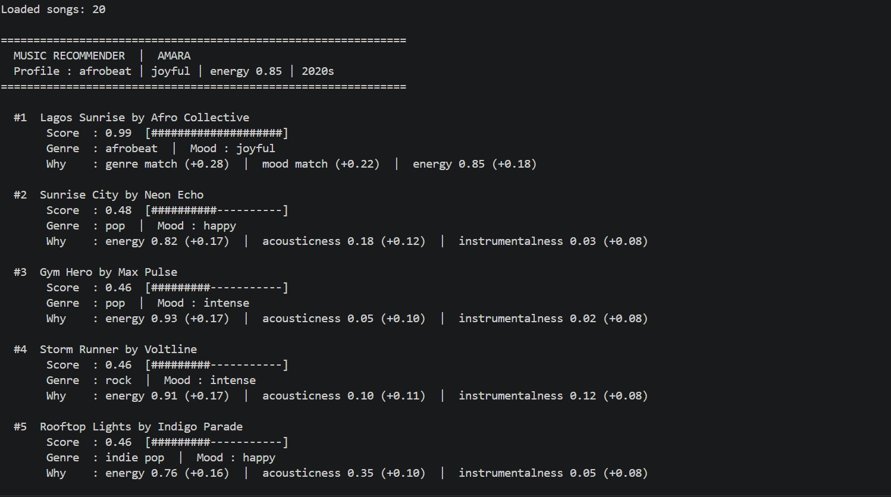

# 🎵 Music Recommender Simulation

## Project Summary

In this project you will build and explain a small music recommender system.

Your goal is to:

- Represent songs and a user "taste profile" as data
- Design a scoring rule that turns that data into recommendations
- Evaluate what your system gets right and wrong
- Reflect on how this mirrors real world AI recommenders

Replace this paragraph with your own summary of what your version does.

---

## How The System Works

Real-world recommenders like Spotify and YouTube work by combining two things: a **scoring rule** that measures how well each song fits a user's taste, and a **ranking rule** that curates the final ordered list. The scoring rule evaluates each song independently against the user's profile using audio features (energy, acousticness, tempo), categorical signals (genre, mood), and behavioral signals (likes, skips, replays). The ranking rule then goes beyond a simple sort — it filters, reorders, and diversifies the results so the user does not just receive five near-identical songs. This simulation prioritizes **content-based filtering**: matching songs to a user purely from their attributes and a stated taste profile, without needing play history or other users' behavior. The emphasis is on transparency — every recommendation can be explained by pointing directly to the features that drove the score.


### Algorithm Recipe

**Data Flow:** User Preferences → Score Every Song → Ranked Output

1. **Load** `data/songs.csv` into a list of song dictionaries.
2. **For each song**, compute a weighted score against the user's preference profile:

| Feature | Weight | How It Is Scored |
|---|---|---|
| `genre` | **0.30** | `1.0` if song genre matches user's preferred genre, `0.0` otherwise |
| `mood` | **0.25** | `1.0` if song mood matches user's preferred mood, `0.0` otherwise |
| `energy` | **0.20** | `1 - abs(song.energy - user.energy)` — penalizes distance from target |
| `acousticness` | **0.15** | `song.acousticness` if user likes acoustic; `1 - song.acousticness` if not |
| `tempo_bpm` | **0.05** | `1 - abs(song.tempo_bpm - user.target_bpm) / 100`, clamped to [0, 1] |
| `danceability` | **0.05** | `1 - abs(song.danceability - user.energy)` — energy used as a proxy |

3. **Sum** all weighted components into a final score between `0.0` and `1.0`:

```
score = (0.30 × genre_match)
      + (0.25 × mood_match)
      + (0.20 × energy_similarity)
      + (0.15 × acoustic_similarity)
      + (0.05 × tempo_similarity)
      + (0.05 × danceability_similarity)
```

4. **Rank** all songs by descending score and return the top `k` (default: 5). Ties are broken by `popularity`.

**Why these weights?** Genre and mood together account for 55% of the score because users think in categorical terms first — "I want chill lofi right now." Energy (0.20) is the strongest continuous signal because loudness and pace are felt immediately. Acousticness (0.15) captures texture preference (live guitar vs. synth). Tempo and danceability (0.05 each) add a small tie-breaking boost but are partially redundant with energy in this catalog. Valence and popularity are excluded: valence has too narrow a range across the 20 songs to meaningfully separate them, and popularity reflects external behavior rather than personal taste fit.

### Potential Biases

- **Genre over-dominance.** At 0.30 weight, a genre mismatch is a near-disqualifier. A gospel song with a perfect energy and mood match for a user who prefers R&B will still score low — even if it would sound like a great fit to a human listener.
- **Mood is binary.** A "joyful" song scores 0 against a "happy" preference even though the two moods are closely related. The system has no understanding of mood proximity.
- **Catalog skew.** 8 of the 20 songs are from 2020. Users who prefer earlier decades will consistently receive lower scores across the board, not because the songs are a bad fit musically, but because the catalog itself is skewed toward recent releases.
- **Energy-as-proxy.** Using `user.energy` as a stand-in for danceability preference assumes active users want danceable songs and calm users do not — a reasonable heuristic, but not always true.

---

## Getting Started

### Setup

1. Create a virtual environment (optional but recommended):

   ```bash
   python -m venv .venv
   source .venv/bin/activate      # Mac or Linux
   .venv\Scripts\activate         # Windows

2. Install dependencies

```bash
pip install -r requirements.txt
```

3. Run the app:

```bash
python -m src.main
```

### Running Tests

Run the starter tests with:

```bash
pytest
```

You can add more tests in `tests/test_recommender.py`.

---

## Experiments You Tried

### Profile 1 — Amara (afrobeat / joyful / high energy)



`Lagos Sunrise` scores 0.99 — the only song in the catalogue that matches genre, mood, energy, and acousticness simultaneously. Songs 2–5 all score ~0.48, showing how much weight the genre+mood match (0.50 combined) carries. Without a genre match, the remaining slots are filled purely by audio proximity.

---

## Limitations and Risks

Summarize some limitations of your recommender.

Examples:

- It only works on a tiny catalog
- It does not understand lyrics or language
- It might over favor one genre or mood

You will go deeper on this in your model card.

---

## Reflection

Read and complete `model_card.md`:

[**Model Card**](model_card.md)

Write 1 to 2 paragraphs here about what you learned:

- about how recommenders turn data into predictions
- about where bias or unfairness could show up in systems like this


---

## 7. `model_card_template.md`

Combines reflection and model card framing from the Module 3 guidance. :contentReference[oaicite:2]{index=2}  

```markdown
# 🎧 Model Card - Music Recommender Simulation

## 1. Model Name

Give your recommender a name, for example:

> VibeFinder 1.0

---

## 2. Intended Use

- What is this system trying to do
- Who is it for

Example:

> This model suggests 3 to 5 songs from a small catalog based on a user's preferred genre, mood, and energy level. It is for classroom exploration only, not for real users.

---

## 3. How It Works (Short Explanation)

Describe your scoring logic in plain language.

- What features of each song does it consider
- What information about the user does it use
- How does it turn those into a number

Try to avoid code in this section, treat it like an explanation to a non programmer.

---

## 4. Data

Describe your dataset.

- How many songs are in `data/songs.csv`
- Did you add or remove any songs
- What kinds of genres or moods are represented
- Whose taste does this data mostly reflect

---

## 5. Strengths

Where does your recommender work well

You can think about:
- Situations where the top results "felt right"
- Particular user profiles it served well
- Simplicity or transparency benefits

---

## 6. Limitations and Bias

Where does your recommender struggle

Some prompts:
- Does it ignore some genres or moods
- Does it treat all users as if they have the same taste shape
- Is it biased toward high energy or one genre by default
- How could this be unfair if used in a real product

---

## 7. Evaluation

How did you check your system

Examples:
- You tried multiple user profiles and wrote down whether the results matched your expectations
- You compared your simulation to what a real app like Spotify or YouTube tends to recommend
- You wrote tests for your scoring logic

You do not need a numeric metric, but if you used one, explain what it measures.

---

## 8. Future Work

If you had more time, how would you improve this recommender

Examples:

- Add support for multiple users and "group vibe" recommendations
- Balance diversity of songs instead of always picking the closest match
- Use more features, like tempo ranges or lyric themes

---

## 9. Personal Reflection

A few sentences about what you learned:

- What surprised you about how your system behaved
- How did building this change how you think about real music recommenders
- Where do you think human judgment still matters, even if the model seems "smart"

