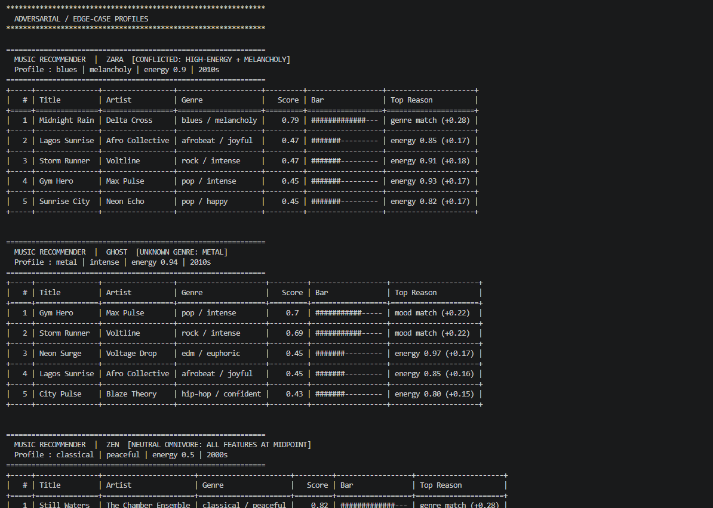

# Model Card: VibeFinder 1.0

---

## 1. Model Name

**VibeFinder 1.0** — a simple music recommender I built for this simulation project.

---

## 2. Goal / Task

The goal is to take a user's music preferences and suggest the five best
matching songs from a small catalogue. The user tells the system things like
their favorite genre, preferred mood, and how energetic they want the music to
feel. The system scores every song and returns the top five with a short reason
for each pick. It does not learn over time — every run starts fresh from the
declared profile.

---

## 3. Data Used

The catalogue has **20 songs** covering 17 genres like pop, lofi, rock,
afrobeat, gospel, blues, classical, and EDM. Each song has 13 attributes
including genre, mood, energy, acousticness, instrumentalness, tempo, valence,
danceability, popularity, and release decade.

The dataset was hand-crafted for this project, not pulled from real streaming
data. Most genres only have one or two songs, and almost everything is from
2010 onward. Older music styles and non-Western genres are barely represented,
which is a known limitation.

---

## 4. Algorithm Summary

For each song, the system calculates a score between 0 and 1 based on how
closely it matches the user's profile. Genre and mood are the two biggest
factors — together they make up half the score. If a song matches the user's
genre exactly it gets a big boost; if it doesn't match at all it gets zero for
that part.

The rest of the score comes from audio features like energy, acousticness, and
instrumentalness. The closer a song's values are to what the user wants, the
higher it scores. Popularity and release decade also factor in, but only
slightly. Once every song has a score, they're sorted highest to lowest and the
top five are returned with an explanation.

---

## 5. Observed Behavior / Biases

The biggest issue I noticed is what I'd call **genre lock-in**. Because most
genres only have one song, that one song almost always ends up at #1 by a huge
margin. After that, the next four spots tend to get filled by the same handful
of high-energy songs regardless of what the user actually asked for.

For example, "Gym Hero" — a pop workout track — kept showing up in results for
afrobeat fans, rock fans, and even a melancholy blues listener. That happens
because its audio numbers (very high energy, very low acousticness) are
close to many different profiles numerically, even when the actual listening
experience would feel completely wrong.

The popularity and decade features barely affect the results in practice. Their
combined weight is so small that a niche listener and a mainstream listener end
up with nearly identical recommendations.

---

## 6. Evaluation Process

I tested eight user profiles total. Five were standard profiles meant to
represent real listener types: Amara (afrobeat/joyful), Jordan (lofi/chill),
Marcus (gospel/uplifting), Taylor (pop/happy), and Rex (rock/intense). Three
were adversarial — designed to stress-test the system: Zara had conflicting
preferences (high energy but melancholy mood), Ghost used a genre not in the
catalogue (metal), and Zen set everything to neutral midpoint values.

The standard profiles all worked well — each one correctly surfaced its
genre-matching song at the top. The most surprising result came from the weight
experiment: I halved the genre weight and doubled the energy weight, which felt
like a big change, but the top result stayed the same for every single profile.
That told me catalogue size matters way more than weight tuning when there's
only one song per genre.

Zara's conflicted profile was interesting too. Even though her energy target was
0.90, the system still ranked Midnight Rain (a slow, quiet blues song) first
because the genre and mood match outweighed the energy gap. That actually felt
like the right call.

---

## 7. Intended Use and Non-Intended Use

**What it's for:** Classroom exploration. It's a good way to see how weighted
scoring and content-based filtering work in a simple, transparent setting.

**What it's not for:** Real product use. The catalogue is too small, the
profiles are static, and the system has no memory between sessions. It also
shouldn't be used to make real decisions about what music someone "should"
like — it's just doing math on audio features, not actually understanding taste.

---

## 7b. Stretch Features Implemented

### Diversity Penalty (Challenge 3)

After scoring all songs, the recommender applies an artist diversity penalty
before returning the final list. If a song's artist already appears earlier
in the ranked results, its score is reduced by 0.15 points. The list is then
re-sorted so the penalty takes effect before slicing to the top-k.

This directly addresses the filter-bubble bias identified in Section 5. In
the Jordan profile, LoRoom appeared in both slot #2 (Midnight Coding) and
slot #3 (Focus Flow). With the diversity penalty active, Focus Flow's score
is reduced from 0.76 to 0.61, allowing Spacewalk Thoughts (a different
artist, ambient/chill) to take slot #3 instead. The user gets more variety
without losing the strongest match at #1. The penalty value (0.15) was chosen
to be meaningful — large enough to demote a repeated artist past one
alternative — but not so large that it overrides a genuinely strong second
match from the same artist.

### Multiple Ranking Modes (Challenge 2)

The recommender now supports four named weight presets that change how songs
are ranked, selectable at call time via `mode=`:

| Mode | Genre | Mood | Energy | Use case |
|---|---|---|---|---|
| `balanced` | 0.28 | 0.22 | 0.18 | Default — general-purpose |
| `genre_first` | 0.45 | 0.22 | 0.12 | Discovery within a genre cluster |
| `mood_first` | 0.15 | 0.42 | 0.18 | Activity/context matching |
| `energy_focused` | 0.10 | 0.10 | 0.42 | Playlist flow — energy continuity |

The presets live in a `RANKING_MODES` dict in `recommender.py`. `score_song`
accepts a `weights` dict, and `recommend_songs` accepts a `mode` string that
looks up the preset before scoring. The terminal output ends with a
mode-comparison section that runs Jordan's profile through all four presets
side by side so the differences are visible at a glance.

The Jordan profile shows real movement across modes. Under `mood_first`,
Spacewalk Thoughts (ambient/chill) rises to slot #3 at score 0.81 — its mood
match is now worth 0.42 points, more than double the balanced weight. Under
`energy_focused`, Coffee Shop Stories enters the top 5 at #4 (score 0.74)
with no genre or mood match at all, purely because its energy (0.37) is the
closest in the catalogue to Jordan's target (0.38). Under `genre_first`,
Focus Flow returns to #3 at 0.61 despite the diversity penalty, because the
genre weight at 0.45 outweighs the mood mismatch. These shifts confirm the
presets produce meaningfully different rankings, not just relabelled output.

### Visual Summary Table (Challenge 4)

Terminal output is now rendered as a formatted table using the `tabulate`
library with the `grid` style. Each row shows the rank, title, artist,
genre/mood, numeric score, an ASCII progress bar scaled to the score, and
the single highest-contributing reason for the recommendation. This replaces
the previous card-style output and makes it easier to compare scores across
all five results at a glance without reading separate blocks of text.

---

## 8. Ideas for Improvement

First, the catalogue needs more songs per genre — at least five per category.
That alone would fix most of the filter bubble problem by giving slots 2–5
something meaningful to compete over.

Second, I'd add a diversity rule that prevents the same genre or artist from
appearing twice in a row in the top five. Right now nothing stops the system
from returning three nearly identical lofi tracks back to back.

Third, I'd replace the energy-as-proxy approach for tempo and danceability.
Using one number as a stand-in for two different preferences produces wrong
results for listeners who are calm but enjoy danceable music — like reggae or
bossa nova fans. Giving users explicit danceability and tempo targets would
make the scoring a lot more accurate.
